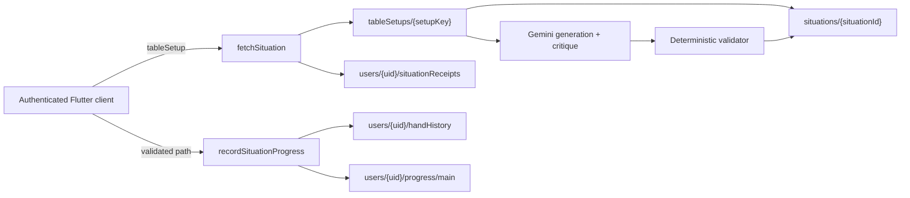

# Architecture

## Trust boundary

The Flutter app is an authenticated rendering and input client. It never holds
an LLM credential, generates training content, grades coaching, lists the
shared situation pool, or persists training/progress data locally.

The active situation graph and current poker state exist in memory for one
hand. Starting another hand requires a successful call to the server.

## Data flow

## Server-owned situation pools

`fetchSituation` canonicalizes each requested table:

- Random Pool keys include seat count, blinds/ante, and starting stack.
  Ordered archetypes and positions are authored inside each situation.
- Custom keys additionally include the exact ordered archetype lineup, hero
  seat, and button seat.

Allocation and the per-user receipt are written atomically. The receipt is
created when content is first delivered. Each fetch prefers situations the
caller has never received. When every prepared situation already has a
receipt, the least-served prepared hand is re-served immediately so the
client does not wait on generation; completed receipts stay completed so
replay does not double-count progress. A refill is still queued so new
hands keep arriving.

New or exhausted pools are marked `queued`; `fetchSituation` returns an
`unavailable` preparation response instead of waiting on Gemini. The Flutter
client polls that exact preparation response for up to nine minutes with
one-, two-, four-, then five-second capped backoff. Those preparation polls
charge a separate per-user hourly poll quota; only a successful situation
allocation increments the hourly deal (fetch) quota. Other network-unavailable
responses fail promptly. Generation publishes each validated situation as soon
as it succeeds (empty pools start with a two-situation ASAP wave, then fill to
five). The same refill is queued when the globally never-served count reaches
three. A setup-level lease makes this idempotent across concurrent Functions
instances. A scheduled job keeps popular Random Pool setups warm.

Clients cannot read `tableSetups` or situation documents directly.

The Flutter client starts `fetchSituation` as soon as training is prepared
(overlapping the route fade) and prefetches the next situation when a hand
ends or the hero folds, so Next rarely waits on a cold network round-trip.

## Branching situation schema

Every payload has `payloadVersion: 2`, starts preflop, and contains:

- table setup, hero cards, lineup, button, blinds/ante, and starting stacks;
- fixed flop/turn/river runouts;
- a directed acyclic node graph;
- hero nodes with curated legal actions and coaching metadata;
- scripted nodes for deterministic opponent actions;
- terminal fold/showdown/all-in outcomes.

Hero actions are selected by stable `actionKey`. Bet and raise amounts use
total chips committed on the street ("raise to"), matching `PokerAction`.

The Flutter `PokerEngine` materializes each node into `GameState`, replays
scripted actions, waits at hero nodes, and follows only the selected edge. It
does not call stochastic villain logic while traversing an authored situation.

## Generation and validation

Firebase Functions calls `gemini-3.8-flash` with the API key provided through
Secret Manager. A first call authors the graph. The next call receives both the
candidate and exact deterministic-validator findings, then critiques and
corrects it. If correction is still needed, later calls repair that same
candidate instead of restarting the full generation pipeline.

Before publication, deterministic validation rejects:

- malformed, cyclic, unreachable, or unterminated graphs;
- non-preflop roots;
- duplicate/invalid cards or incorrect street boards;
- missing hero action coverage or invalid coaching fields;
- illegal call, bet, raise, or all-in sizing;
- inconsistent stacks, street commitments, pots, or chip totals;
- coaching verdict/optimal-action contradictions.

Invalid model output is repaired or retried and never becomes servable.
Successful, duplicate, and failed generation runs are recorded under
`tableSetups/{setupKey}/generationRuns`. Each run stores Gemini prompt,
candidate, thinking, cached, and total token counts plus an estimated cost in
USD micros. `tableSetups/{setupKey}.generationMetrics` aggregates those values,
and each published situation stores the usage attributable to that situation.
The pricing-version field identifies the rates used for each estimate. The
calculator automatically switches from the introductory rate to the published
standard Gemini 3.8 Flash rate on January 1, 2027.

## Progress

`recordSituationProgress` accepts only a situation previously allocated to the
caller. It walks the server's stored graph and verifies every reported hero
node/action and terminal result. The server derives grading and hand summaries
from the authored edges rather than accepting client-supplied verdicts.

Server history feeds `HeroProfiler`, preserving sample-gated VPIP/PFR, 3-bet,
aggression, showdown, street, archetype, style, and trend calculations.
Progress aggregates provide coaching accuracy and EV deltas.

Leak Finder and Coach Review do not exist in the new pipeline.

## Client persistence

Firestore offline persistence is disabled. Training, receipts, hand history,
profile metrics, and coaching are not written to SQLite or SharedPreferences.
Legacy local databases/avatar files are removed once during upgrade. A
`legacyCleanupVersion` SharedPreferences marker gates that idempotent migration;
the marker is operational metadata, not training data.

SharedPreferences remains only for SFX/music preferences. Gameplay preferences
and identity are stored in Firestore. User-uploaded avatars are stored under
`avatars/{uid}/` in Firebase Storage.

## Firebase access

- User root documents: owner read; validated identity/preferences writes.
- `situationReceipts`: Functions/Admin only.
- `handHistory` and `progress`: owner read, Functions/Admin write.
- `tableSetups` and nested `situations`: Functions/Admin only.
- Avatar objects: authenticated reads; owner-only image writes with size limits.
- Everything else: denied.

The project uses the Standard edition, native-mode `(default)` Firestore
database in `nam5`; Functions run in `us-central1`.

## Tests

Functions tests cover setup canonicalization, leases/allocation, graph
validation, coaching metadata, and server-derived progress. Flutter tests cover
payload parsing, graph traversal, server coaching display, network-required
error states, and Progress without removed features.
